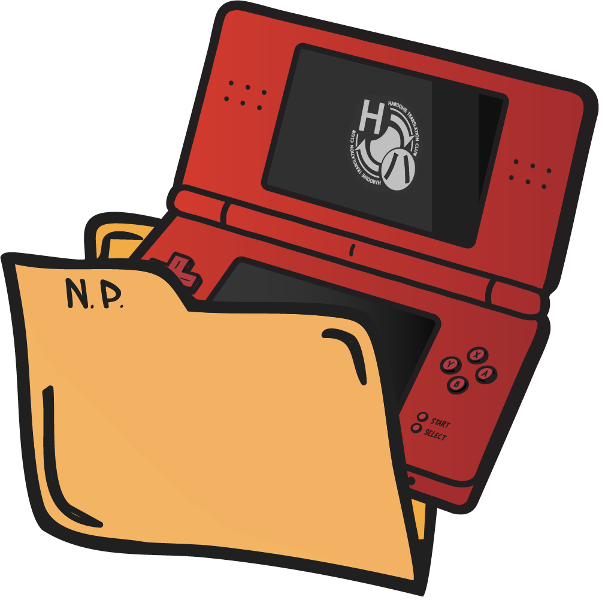

<h1 align="center">
  
  <br/>
  NitroPacker
  <br/>
  <a href="https://www.nuget.org/packages/HaroohieClub.NitroPacker"></a>
</h1>
NitroPacker is an open source, cross-platform utility for packing and unpacking Nintendo DS ROMs. It also can apply ASM hacks to both ARM9 and overlay files.

## Authors
This code was written primarily by [Ermelber](https://www.ermiisoft.net/) and [Gericom](https://github.com/Gericom). [Jonko](https://jonkode.su) has ported it to .NET 8.0 and made modifications to make it cross-platform and has added a number of features since the project was open sourced. The logo was designed by [Judy Cheng](https://cjudy.com).

## Migrating 2.x Projects to 3.x
For versions 3.0 and 3.1 of NitroPacker, the CLI will have built-in functionality for migrating 2.x projects to 3.0. To do this, simply run:
```
NitroPacker migrate -p PATH/TO/PROJECT.xml
```
However, because of the host of new features available in NitroPacker 3.0, it is strongly recommended to simply unpack your projects again using the 3.0 version.

For information on the breaking API changes in 3.0, please check [the migration documentation](MIGRATE.md).

## Packing and Unpacking
The primary purpose of NitroPacker is to pack and unpack NDS ROMs.

### Unpacking
To unpack a ROM with NitroPacker, run the following command:
```
NitroPacker unpack -r PATH/TO/ROM.nds -o PATH/TO/UNPACK/DIRECTORY -p PROJECT_NAME
```
Replace the capitalized arguments with:
* `PATH/TO/ROM.nds` &ndash; the path to the Nintendo DS ROM you want to unpack
* `PATH/TO/UNPACK/DIRECTORY` &ndash; the path to the directory you want to unpack the ROM to
* `PROJECT_NAME` &ndash; the name of the project file that will be created on unpack (can be anything but usually should be the name of the game)

This command will unpack all the game's files and place them in the specified directory. The ROM's file system will go in the `data` subdirectory, while
any overlays present will be placed in the `overlay` subdirectory. The main ARM9 and ARM7 binaries will be placed in the root directory. Additionally, the created project file contains a bunch of metadata about the ROM, such as the ROM header, the overlay table, and the banner.

In order to disassemble or patch arm9.bin, you'll need it to be decompressed. If the arm9 binary is compressed, you can append the `-d` flag to the above command to decompress it, e.g.
```
NitroPacker unpack -r PATH/TO/ROM.nds -o PATH/TO/UNPACK/DIRECTORY -p PROJECT_NAME -d
```

Finally, it is possible some games may require that their file allocation tables be in a certain order. In this case, to be able to repack successfully, you will need to pass `-f`.

### Packing
NitroPacker can only pack a directory that was previously unpacked with NitroPacker (or something structured exactly like that). To pack a ROM, run the following command:
```
NitroPacker pack -p PATH/TO/PROJECT_FILE.json -r PATH/TO/OUTPUT_ROM.nds
```

The project file is expected to be in a directory with ARM9 and ARM7 binaries as well as the data and overlay subdirectories mentioned previously. If the ARM9 binary was decompressed previously, you will need to add `-c` in order to compress it at this stage.

## ASM Hacks
NitroPacker can also be used as a powerful tool to apply assembly hacks, but this functionality is a bit more complicated.

### Arena Lo
Feel free to come back to this section after you've read up on the specific path that you want to pursue; this is here because it is common to both.

Prior to assembling the ARM9, you will need to find the arena lo offset. This value can be found by searching for `0x37F8000` in the ROM.
IDA or Ghidra should be used to search for this value. Once you find it, you'll want to go back a few values until you see an offset that has a value
between 0x20C0000 and 0x20F0000 (typically, although it could be higher or lower!) &ndash; the offset (not the value) is the arena lo offset.
It will most likely be followed by two subroutines that look like:

```arm
MOV             R0, R0,LSL#2
ADD             R0, R0, #0x2700000
ADD             R0, R0, #0xFF000
STR             R1, [R0,#0xDC4]
BX              LR

...

MOV             R0, R0,LSL#2
ADD             R0, R0, #0x2700000
ADD             R0, R0, #0xFF000
STR             R1, [R0,#0xDA0]
BX              LR
```

Finally, source files may have any valid ARM assembly. To hook into a function and create a branch link to your code, the following format should be used:

```arm
ahook_02061344:
   CODE_HERE
   bx lr
```

This method will replace the instruction at 0x02061344 with a BL to your code.

### Using Ninja & LLVM
The newer path for compiling assembly hacks is to use a combination of Ninja & LLVM. This path is easier to execute as both of these programs are
easy to install and use. However, as noted below, there are no precompiled libraries shipped with this route, so you will need to bring your own.

#### Install Prerequisites
Ninja can be downloaded from its releases [here](https://github.com/ninja-build/ninja/releases). However, if you are on a Linux system, you will likely
be able to install it via your package manager with something like `sudo apt install ninja-build` (Debian/Ubuntu example). Furthermore, on macOS, ninja
can be installed via [Homebrew](https://brew.sh) with `brew install ninja`.

LLVM distributes binaries on all operating systems. We recommend using LLVM-19 or later. The binaries for the last version
of LLVM 19 can be found [here](https://github.com/llvm/llvm-project/releases/tag/llvmorg-19.1.6). For Windows, you will want `LLVM-19.1.6-win64.exe` or
`LLVM-19.1.6-woa64.exe` depending on whether you are running an x64 or ARM64 machine. Again, however, if you are on Linux, you can install the specific
components you need from your package manager with a command similar to `sudo apt install clang-19 lld-19`. (Note that you only need to install clang and lld
for our purposes.) On macOS, LLVM can be installed with Homebrew via `brew install llvm` (or `brew install llvm@19` for llvm-19 specifically).

#### Directory Structure
You will need to move the unpacked `arm9.bin` to a different directory with a specific structure:

* `src`
  - `overlays`
    - `main_HEXOVERLAYNUM` &ndash; the name here corresponds to the name of the overlay in the unpacked `overlay` directory
      - `replSource` &ndash; a directory containing subdirectories with instructions to be directly replaced in the specified overlay
        - `HEXLOCATION.s` &ndash; a source file containing an instruction to replace at the specified `HEXLOCATION`
      - `source` &ndash; a directory containing source files to append to the specified overlay
        - `file.s` &ndash; ARM assembly source files that will be assembled and appended to the overlay
        - `file.c` &ndash; C source files that will be compiled and appended to the overlay
        - `file.s.override` &ndash; a source file that will be assembled _only if_ `--override-suffix "override"` is passed to NitroPacker (and will replace `file.s` in that case)
      - `symbols.x` &ndash; an editable symbols file that allows for naming specific offsets for use in specified overlay's source files
    - `linker.x` &ndash; boilerplate linker file for overlays
  - `replSource` &ndash; a directory containing subdirectories with instructions to be directly replaced in the ARM9
    - `HEXLOCATION.s` &ndash; a source file containing an instruction to replace at the specified `HEXLOCATION`
  - `source` &ndash; a directory contianing source files to append to the ARM9
    - `file.s` &ndash; ARM assembly source files that will be assembled and appended to the ARM9
    - `file.c` &ndash; C source files that will be compiled and appended to the ARM9
    - `file.s.override` &ndash; a source file that will be assembled _only if_ `--override-suffix "override"` is passed to NitroPacker (and will replace `file.s` in that case)
  - `arm9.bin` &ndash; the main ARM9 &ndash; must be copied in from the unpacked ROM directory
  - `linker.x` &ndash; boilerplate linker file for ARM9
  - `symbols.x` &ndash; an editable symbols file that allows for naming specific offsets for use in ARM9 source files

This directory structure should be copied from the `asm_ninja_llvm` directory in this repo. A fully fleshed-out example can be found in the [ChokuretsuTranslationBuild repository](https://github.com/haroohie-club/ChokuretsuTranslationBuild/tree/main/src).

#### Assembling Hacks
To assemble hacks using Ninja & LLVM, run the following command:
```
NitroPacker patch-arm9 -i PATH/TO/SRC/DIRECTORY -o PATH/TO/OUTPUT/DIRECTORY --input-overlays PATH/TO/ORIGINAL/OVERLAY/DIRECTORY --output-overlays PATH/TO/PATCHED/OVERLAY/DIRECTORY -n PATH/TO/NINJA -l PATH/TO/LLVM/DIRECTORY [-s PATH/TO/SYMTABLEHELPER] -p PROJECT_FILE -a ARENA_LO_OFFSET
```

The LLVM directory is the root installation (on Windows, usually `C:\Program Files\LLVM`; on Linux, often `/usr/lib/llvm`). The SYMTABLEHELPER path can usually be omitted as it is an executable that is bundled with NitroPacker; you only need to specify it if you have placed this executable somewhere other than next to NitroPacker.

### Using Make & devkitARM or Docker
The legacy path for compiling assembly hacks is to use a combination of Make & devkitARM or Docker. This path is a bit more cumbersome to execute,
especially if you're on Windows and not already familiar with Docker. However, it has the distinct advantage of coming with devkitARM's precompiled
libraries for ease of use in C programs. If you're not going to make use of those, however, you should probably do the Ninja/LLVM path.

#### Install Prerequisites
NitroPacker relies on other programs to help with the assembling your hacks in the legacy path; namely, devkitARM and Make. DevkitARM is distributed
by devkitPro and can be downloaded from their website. They have a graphical installer for Windows (for which you need only select the NDS workloads)
and a package manager for Mac/Linux (for which you can run the command `dkp-pacman -S nds-dev` to install devkitARM).

On Linux distros, Make can be installed from the package manager (e.g. `sudo apt install make`). On macOS, you can use [brew](https://formulae.brew.sh/formula/make). On Windows, the easiest way to install it is with Chocolatey, where the command is `choco install make`.

If either of these options presents a challenge for you or doesn't work for some reason, you can instead opt to use the alternate method of assembling
the code in Docker containers. After installing [Docker Desktop](https://www.docker.com/products/docker-desktop/) or the Docker engine, ensure the engine
is running. Then, when calling NitroPacker, ensure you pass `-d` followed by the Docker tag you want to use. If you're not sure which one to use, 
we recommend choosing `latest`. See [devkitpro/devkitarm on DockerHub](https://hub.docker.com/r/devkitpro/devkitarm) for more details.

#### Directory Structure
You will need to move the unpacked `arm9.bin` to a different directory with a specific structure:

* `src`
  - `overlays`
    - `main_HEXOVERLAYNUM` &ndash; the name here corresponds to the name of the overlay in the unpacked `overlay` directory
      - `replSource` &ndash; a directory containing subdirectories with instructions to be directly replaced in the specified overlay
        - `HEXLOCATION` &ndash; the location of an instruction to replace
          - `HEXLOCATION.s` &ndash; a source file containing an instruction to replace at the specified `HEXLOCATION`
      - `source` &ndash; a directory containing source files to append to the specified overlay
        - `file.s` &ndash; ARM assembly source files that will be assembled and appended to the overlay
        - `file.c` &ndash; C source files that will be compiled and appended to the overlay
        - `file.s.override` &ndash; a source file that will be assembled _only if_ `--override-suffix "override"` is passed to NitroPacker (and will replace `file.s` in that case)
      - `symbols.x` &ndash; an editable symbols file that allows for naming specific offsets for use in specified overlay's source files
    - `linker.x` &ndash; boilerplate linker file for overlays
    - `Makefile` &ndash; boilerplate Makefile for overlays
  - `replSource` &ndash; a directory containing subdirectories with instructions to be directly replaced in the ARM9
    - `HEXLOCATION` &ndash; the location of an instruction to replace
      - `HEXLOCATION.s` &ndash; a source file containing an instruction to replace at the specified `HEXLOCATION`
  - `source` &ndash; a directory contianing source files to append to the ARM9
    - `file.s` &ndash; ARM assembly source files that will be assembled and appended to the ARM9
    - `file.c` &ndash; C source files that will be compiled and appended to the ARM9
    - `file.s.override` &ndash; a source file that will be assembled _only if_ `--override-suffix "override"` is passed to NitroPacker (and will replace `file.s` in that case)
  - `arm9.bin` &ndash; the main ARM9 &ndash; must be copied in from the unpacked ROM directory
  - `linker.x` &ndash; boilerplate linker file for ARM9
  - `Makefile` &ndash; boilerplate Makefile for ARM9
  - `symbols.x` &ndash; an editable symbols file that allows for naming specific offsets for use in ARM9 source files

This directory structure should be copied from the `asm_make_devkitarm` directory in this repo. A fully fleshed-out example can be found in the [ChokuretsuTranslationBuild repository](https://github.com/haroohie-club/ChokuretsuTranslationBuild/tree/main/src).

#### Assemble ARM9
To assemble the hacked ARM9, run the following command:
```
NitroPacker patch-arm9 -i PATH/TO/SRC/DIRECTORY -o PATH/TO/OUTPUT/DIRECTORY -p PROJECT_FILE -a ARENA_LO_OFFSET [-d DOCKER_TAG]
```
The project file you need to supply is the one created by unpacking the ROM with NitroPacker. The project file is only needed for determining the ARM9's RAM address; if you would rather specify this address manually, you may use `-r RAM_ADDRESS` instead.

This will assemble the hacks and append them to `arm9.bin`, then copy the ARM9 to the output directory (which should be the directory you will then run
the `pack` command on).

Note: To be able to use the `patch-arm9` command, the `arm9.bin` *must* be decompressed. See the [`Unpacking`](#Unpacking) section for more information on how to do this. 

#### Assemble Overlays
To patch the overlays, run the following command:
```
NitroPacker patch-overlays -i PATH/TO/ORIGINAL/OVERLAY/DIRECTORY -o PATH/TO/PATCHED/OVERLAY/DIRECTORY -s PATH/TO/OVERLAY/SOURCE -r PATH/TO/PROJECT/FILE [-d DOCKER_TAG]
```

## Building from Source
To build the project from source, ensure [.NET 8](https://dot.net) is installed. After you have installed .NET, you should be able
to simply run `dotnet build` from the terminal within the root directory and it will build the NitroPacker executable. You can also
open the solution in Visual Studio, Rider, or another IDE and build it from there.